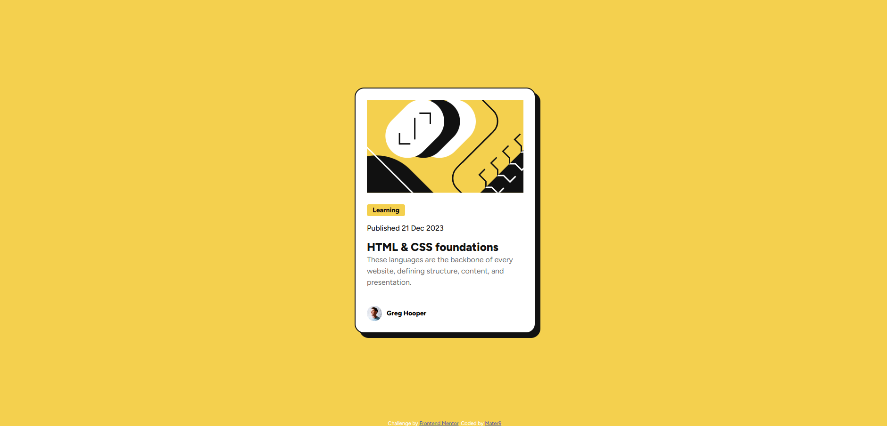

# Frontend Mentor - Blog preview card solution

This is a solution to the [Blog preview card challenge on Frontend Mentor](https://www.frontendmentor.io/challenges/blog-preview-card-ckPaj01IcS). Frontend Mentor challenges help you improve your coding skills by building realistic projects.

## Table of contents

- [Overview](#overview)
  - [The challenge](#the-challenge)
  - [Screenshot](#screenshot)
  - [Links](#links)
- [My process](#my-process)
  - [Built with](#built-with)
  - [What I learned](#what-i-learned)
  - [Continued development](#continued-development)
  - [Useful resources](#useful-resources)
- [Author](#author)

## Overview

### The challenge

Users should be able to:

- View the optimal layout depending on their device's screen size
- See hover and focus states for interactive elements

### Screenshot



### Links

- Solution URL: [Add solution URL here](https://your-solution-url.com)
- Live Site URL: [Add live site URL here](https://your-live-site-url.com)

### Built with

- Semantic HTML5 markup
- CSS custom properties
- Flexbox
- Mobile-first workflow
- CSS transitions for hover effects
- Google Fonts
- CSS Box Shadow effects

### What I learned

During this project, I strengthened my skills in:

- Creating responsive card layouts using Flexbox
- Implementing hover states and transitions
- Working with CSS custom properties
- Using box-shadow for depth effects
- Proper HTML semantic structure

Some key code snippets I'm proud of:

```css
.card {
  border: 2px solid hsl(0, 0%, 7%);
  box-shadow: 10px 10px 0px hsl(0, 0%, 7%);
  display: flex;
  flex-direction: column;
  justify-content: space-between;
}

h1:hover {
  color: hsl(47, 88%, 63%);
}
```

## Author

- Frontend Mentor - [@Mater9](https://www.frontendmentor.io/profile/Mater9)
